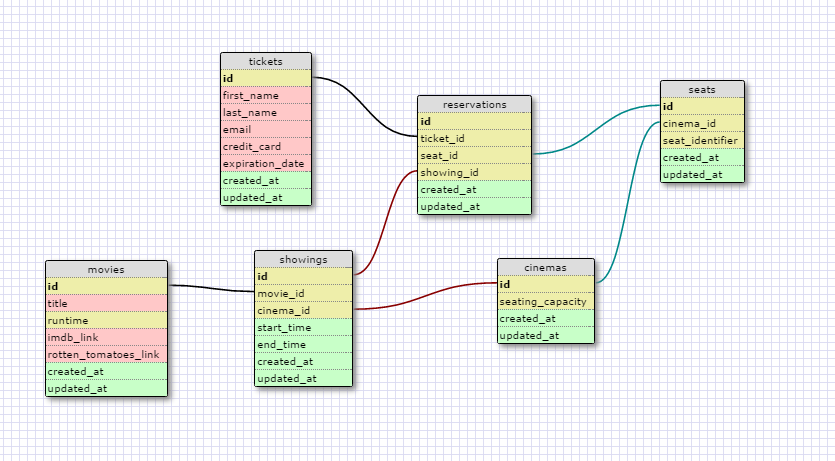

# Coding Challenge for LaunchPad Labs

Project Start Time: 2/15/2017
Project Status: Working

# Work Log
1. Designing Schema Visually

# Thought Process
When I start with a rails application, I like to design my SQL schema visually first for all my models.

Schema:

