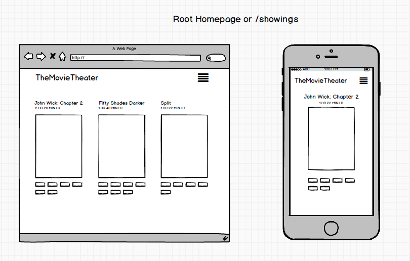
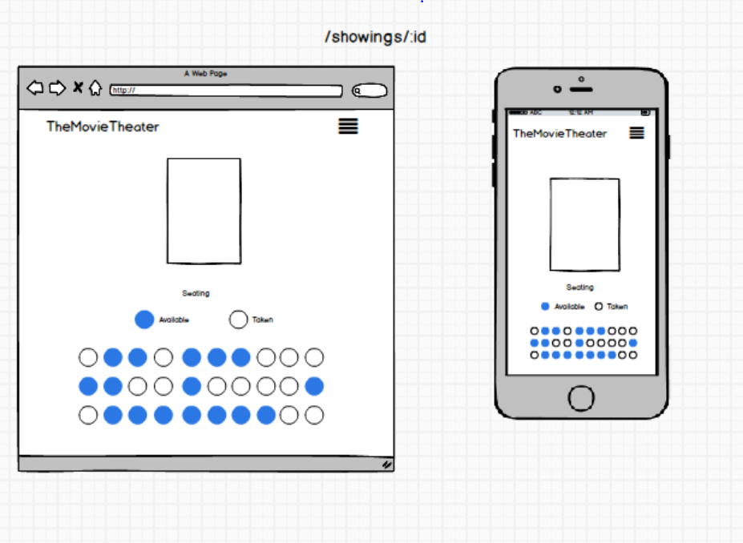

# Coding Challenge for LaunchPad Labs

View: [Heroku Link](http://movietheater.herokuapp.com/)

Project Start Time: 2/15/2017

Project Status: Finshed

# Work Log
1. Designing Schema Visually
2. Create RSpec test for Models and Associations
3. Build toward passing the RSpec test
4. Refactor RSpec test and Models/Associations methods
5. Ensure all tests for Models/Associations are passing before starting Front-End work
6. Setup Bootstrap framework environment
7. Establish Header Layout(Header Title and Menu Button)
8. Deploy to heroku to test on mobile phone rather than chrome dev tool mobile view
9. Wireframe Basic Layout with Routes
10. Create Routes/Controllers
11. Setup Database seeds
12. Finish Homepage(/)
13. Finish Showing Page(/showings/:id)
14. Finish Ticket Purchase with Mailing
15. Finish Cinema Pages(create/edit)
16. Finish Showing Pages(create/show)
17. Finish Movie Pages(create/show)
18. Finish Order Display(show)

# Thought Process
When I start with a rails application, I like to design my SQL schema visually first for all my models.

Schema:

Wireframe:

## Design Decisions
When designing the UI/UX, I kept a couple thoughts in my head about how I would approach this. First thing I want to go over is the User Experience. I designed the homepage such that a customer could visit and know exactly what to do. I list all the movies with clickable showtime buttons beneath the poster, this allowed the user to just click a showtime and see more information about the movie/showtime. If you click the movie poster, it brings you to a page about the movies information. I felt that it was a bit repetitive to have the same information on both pages, if I were to refactor this, I probably would combine the movie show page with showtimes and allow the client to navigate throughout all the showtimes.

The prompt stated to only worry about a single ticket at a time. I chose an interactive seat grid to process a single ticket because I felt like it gave the customer more of a visual decision on where they want to sit. It only works with purchasing one ticket, but if I were to optimize for a multi-ticket purchase, I would allow the user to select multiple seats and purchase tickets at one time. I would probably list the seat identifiers above or on the bubbles so the customer knows exactly where they are sitting. The email receipt gives information about their seat, but I think it would improve the UX a whole lot if it was given in the application.

The cinema management was tricky for me. I haven't gotten a lot of exposure at Dev Bootcamp about product design/UX design but I enjoyed how this specific task challenged me. There is a couple flaws in my design, such as accounting for the tickets/reservations behind a cinema that is being managed. I felt like it didn't make sense to alter a cinema's screening on the same day, so when a theater owner changes a future showtime, all tickets/reservations gets destroyed, or essentially refunded. If I had more time on this project, I would rethink my database design as well as my associations and find a better way to manage all the relational data as well as improve the overall UI/UX design for the theater management. What I have built right now is very minimalistic and doesn't account for some important things, however it is functional.

Displaying orders was minimal, as it displays basic information about all orders. If I were to comeback to the application, one thing I would focus on is making the process of viewing orders very intuitive. What I mean by that is I would think about designing a hub where the client would be able to make easy queries for information. The current version I have allows the client to view this information, but in a very non-interactive and basic way(links).

Thinking about Human Interaction and my App, I can see a lot of improvements needs to be made to the application, such as directions of where to go, designing a better order receipt, making it clear of what movie they are watching as well as the time. Also to reiterate, allowing the customer to purchase multiple tickets at once because buying one ticket doesn't make sense in the point of view of a customer.

#Final thoughts
The most difficult part of this coding challenge was coming up with a Strong User Experience and Interface. I would say product design is a weak skillset I possess, but constant iteration on user-focused projects is what's helping my creativity get stronger. I enjoyed the challenge of this assignment and I'm looking forward to more in the future. Though this application has a couple weak features, an iteration of this project I think can make a good real-world market product.
